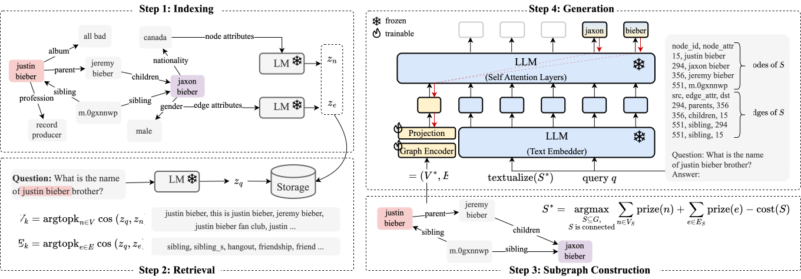

# G-Retriever

[](https://arxiv.org/abs/2402.07630)

This repository contains the source code for the paper ["<u>G-Retriever: Retrieval-Augmented Generation for Textual Graph Understanding and Question Answering</u>"](https://arxiv.org/abs/2402.07630).

We introduce **G-Retriever**, a flexible question-answering framework targeting real-world textual graphs, applicable to multiple applications including scene graph understanding, common sense reasoning, and knowledge graph reasoning.


**G-Retriever** integrates the strengths of Graph Neural Networks (GNNs), Large Language Models (LLMs), and Retrieval-Augmented Generation (RAG), and can be fine-tuned to enhance graph understanding via soft prompting.



## Citation
```
@article{he2024g,
  title={G-Retriever: Retrieval-Augmented Generation for Textual Graph Understanding and Question Answering},
  author={He, Xiaoxin and Tian, Yijun and Sun, Yifei and Chawla, Nitesh V and Laurent, Thomas and LeCun, Yann and Bresson, Xavier and Hooi, Bryan},
  journal={arXiv preprint arXiv:2402.07630},
  year={2024}
}
```

## Environment setup
```
conda create --name g_retriever python=3.9 -y
conda activate g_retriever

# https://pytorch.org/get-started/locally/
conda install pytorch==2.0.1 torchvision==0.15.2 torchaudio==2.0.2 pytorch-cuda=11.8 -c pytorch -c nvidia

python -c "import torch; print(torch.__version__)"
python -c "import torch; print(torch.version.cuda)"
pip install pyg_lib torch_scatter torch_sparse torch_cluster torch_spline_conv -f https://data.pyg.org/whl/torch-2.0.1+cu118.html

pip install peft
pip install pandas
pip install ogb
pip install transformers
pip install wandb
pip install sentencepiece
pip install torch_geometric
pip install datasets
pip install pcst_fast

```

## Data Preprocessing
```
# expla_graphs
python -m src.dataset.preprocess.expla_graphs
python -m src.dataset.expla_graphs

# scene_graphs, might take
python -m src.dataset.preprocess.scene_graphs
python -m src.dataset.scene_graphs

# webqsp
python -m src.dataset.preprocess.webqsp
python -m src.dataset.webqsp
```

## Training
Replace path to the llm checkpoints in the `src/model/__init__.py`, then run

### 1) Inference-Only LLM
```
python inference.py --dataset scene_graphs --model_name inference_llm --llm_model_name 7b_chat
```
### 2) Frozen LLM + Prompt Tuning
```
# promot tuning
python train.py --dataset scene_graphs_baseline --model_name pt_llm

# G-Retriever
python train.py --dataset scene_graphs --model_name graph_llm
```

### 3) Tuned LLM
```
# finetune LLM with LoRA
python train.py --dataset scene_graphs_baseline --model_name llm --llm_frozen False

# G-Retriever with LoRA
python train.py --dataset scene_graphs --model_name graph_llm --llm_frozen False
```

## Reproducibility
Use `run.sh` to run the codes and reproduce the published results in the main table.
